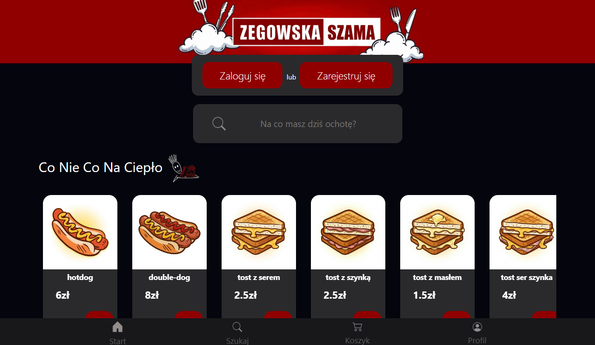
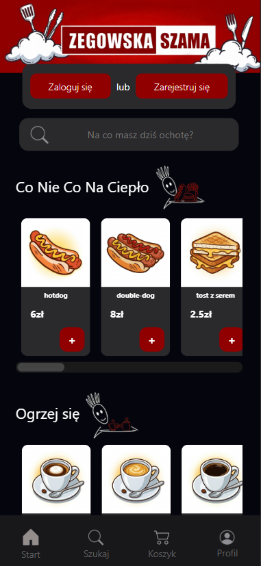
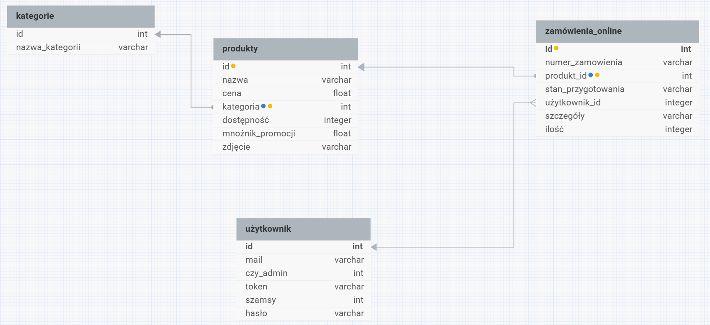

# Zegowska-szama

Nowoczesna aplikacja webowa stworzona na rzecz projektu szkolnego, umożliwiająca wygodne przeglądanie asortymentu oraz zamawianie jedzenia online w sklepiku szkolnym. Projekt oferuje pełną responsywność, intuicyjny interfejs oraz wsparcie dla ciemnego motywu.

---

## Podgląd projektu

### Wersja Desktopowa (Komputer)

  

### Wersja Mobilna (Smartfon)

  

---

## Schemat bazy danych (ERD)

  

---

## Główne Funkcje

- **Autentykacja użytkowników:** Bezpieczny system rejestracji i logowania.
- **Składanie zamówień:** Interaktywny koszyk zakupowy umożliwiający zamawianie szamy online.
- **Zarządzanie profilem:** Dedykowany panel użytkownika do edycji ustawień i podglądu danych.
- **Ciemny motyw (Dark Mode):** Pełne dostosowanie wizualne strony zapewniające komfortowe użytkowanie o każdej porze.
- **Zarządzanie stroną:** Panel administratora/sklepiku do przeglądania złożonych zamówień oraz aktualnych promocji.

---

## Technologie

- **HTML5**
- **CSS3**
- **JavaScript**
- **Bootstrap 5**
- **PHP** (Logika aplikacji / Backend)
- **Baza danych:** MySQL / MariaDB

---

## Środowisko deweloperskie

- **System operacyjny:** Windows 10 / 11
- **Środowisko serwerowe:** XAMPP (Apache, MySQL)
- **IDE:** Visual Studio Code
- **Projektowanie bazy:** DBDesigner
- **Sugerowane przeglądarki:** Google Chrome, Microsoft Edge, Mozilla Firefox, Opera, Safari
---

## Dokumentacja Projektu

Pełna, szczegółowa dokumentacja techniczna systemu, opis wymagań oraz instrukcja obsługi aplikacji znajdują się w pliku w głównym katalogu repozytorium:
- **[Dokumentacja-Zegowska-Szama.txt](Dokumentacja-Zegowska-Szama.txt)**

---

## Zarządzanie Projektem

Prace nad aplikacją, podział zadań oraz postęp prac deweloperskich zarządzane są przy użyciu dedykowanej tablicy:
- **[Zobacz naszą tablicę Trello](https://trello.com/invite/b/69dcec194476c33e612e9348/ATTIee1ee2d5b30f57563f103dab0a5dc6b184AAF939/zegowska-szama)**

---

## Autorzy

Projekt został stworzony i jest rozwijany przez:

- [@Bartosz Bąk](https://www.github.com/BartBak1507) – Współautor projektu, rozwój aplikacji.
- [@Bartosz Bachul](https://www.github.com/bart-tek08) – Współautor projektu, rozwój aplikacji.
